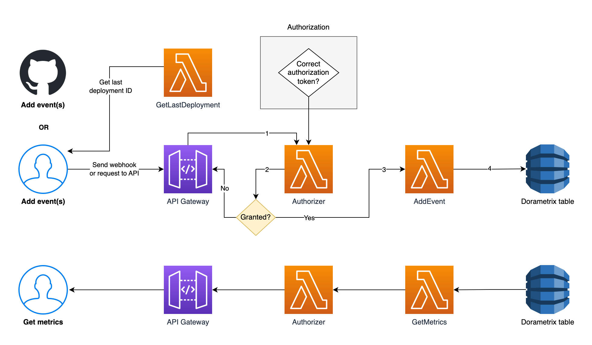
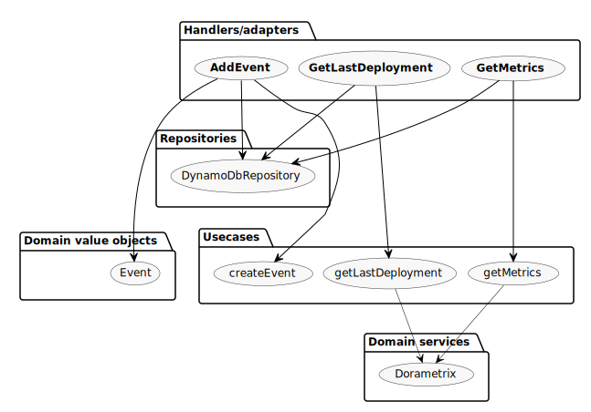
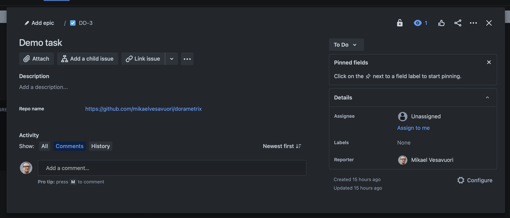

# Dorametrix 🚀 🧑‍🚀 🧑🏿‍🚀 🧑🏻‍🚀 👩‍🚀 📈

 [](https://app.fossa.com/projects/git%2Bgithub.com%2Fmikaelvesavuori%2Fdorametrix?ref=badge_shield) [](https://sonarcloud.io/summary/new_code?id=mikaelvesavuori_dorametrix) [](https://codescene.io/projects/23699) [](https://codescene.io/projects/23699) [](https://codecov.io/gh/mikaelvesavuori/dorametrix) [](https://codeclimate.com/github/mikaelvesavuori/dorametrix/maintainability)

## Know if you are running high-performing software development teams by making it clear how individual products (i.e. services, APIs, systems...) line up with the [DORA metrics](https://www.leanix.net/en/wiki/vsm/dora-metrics).

Dorametrix is a Node.js-based service that helps you calculate your DORA metrics, by inferring your metrics from events you can create manually or with webhooks. It has pre-baked support for push and incident events from GitHub Actions, Bitbucket and Jira (only incidents!), and can be run "as is" as a web service, too.

🏖️ It's super easy to get started with, comes pre-packaged and needs just a tiny bit of fiddling with webhooks and settings on your end: Simply put, the easiest way you can start using DORA metrics in a scalable way today!

✋ ℹ️ Credit where credit is due: This project is strongly influenced by [Google Cloud's `Four Keys`](https://github.com/GoogleCloudPlatform/fourkeys) project. The Four Keys project is great but is, for obvious reasons, Google Cloud-oriented. It also uses a SQL database and ETL pattern which is less than ideal from a serverless perspective. In general, the approach and the structuring and nomenclature is the same here. Most interestingly, that Dorametrix is better decoupled from the specifics of any one CI tool, and uses DynamoDB (NoSQL) instead of BigQuery.

## How Dorametrix works

At its heart, Dorametrix is a serverless web service that collects and represents specific delivery-related events that you send to it, which are then stored in a database. As a user you can request these metrics, which are calculated from the same stored events.

_For more exact information, see the section "What are the DORA metrics and how does Dorametrix calculate them?" further down._

### The events

The most basic data type we have is the **Event**. These are internally created from inputs to the service. For example, when you push a commit, an Event is added to the database. The event will contain, for example, information like the commit SHA, time of the commit, and similar. We keep the events indefinitely so we can have a complete record of all Dorametrix events that have occurred.

Dorametrix will also (on its own) add individual domain-specific records for (respectively) a Change, Deployment, or Incident, based on the incoming data. This is so we can easily follow up on those typologies and make the desired calculations.

- **Changes** essentially correspond to `push`-type lifecycle events, since these represent commits.
- **Deployments** are added by you manually, as a separate activity at the end of a deployment pipe.
- **Incidents** are special, and more complex, since they both have to be raised and (later) be resolved. This can be done manually by calling Dorametrix but it's highly recommended (and much more practical) to let your issue tracker send such events by webhook based on actual user interactions with issues or tickets.

---

## Diagrams

### Solution diagram

_As it stands currently, Dorametrix is implemented in an AWS-oriented manner. This should be fairly easy to modify so it works with other cloud platforms and with other persistence technologies. If there is sufficient demand, I might add extended support. Or you do it! Just make a PR and I'll see how we can proceed._



### Code flow diagram



Please see the [generated documentation site](https://dorametrix.pages.dev) for more detailed information.

---

## Prerequisites

- Recent [Node.js](https://nodejs.org/en/) (ideally 18+) installed.
- Amazon Web Services (AWS) account with sufficient permissions so that you can deploy infrastructure. A naive but simple policy would be full rights for CloudWatch, Lambda, API Gateway, DynamoDB, X-Ray, and S3.
- Ideally some experience with [Serverless Framework](https://www.serverless.com) as that's what we will use to deploy the service and infrastructure.
- You will need to deploy the stack prior to working with it locally as it uses actual infrastructure even in local mode.

## Installation

Clone, fork, or download the repo as you normally would. Run `npm install --force`.

## Commands

The below commands are the most critical ones. See `package.json` for more commands! Substitute `npm` for `yarn` or whatever floats your boat.

- `npm start`: Run Serverless Framework in offline mode
- `npm test`: Run tests on the codebase
- `npm run deploy`: Deploy with Serverless Framework
- `npm run build`: Package and build the code with Serverless Framework
- `npm run teardown`: Removes the deployed stack

## Configuration

### Application settings

You can set certain values in `serverless.yml`.

#### Required

- `custom.config.accountNumber`: Your AWS account number.
- `custom.config.apiKey`: The "API key" or authorization token you want to use to secure your service.

Note that all unit tests use a separate authorization token that you don't have to care about in regular use.

#### Optional

- `custom.config.maxDateRange`: This defaults to `30` which is a reasonable default.
- `custom.config.maxLifeInDays`: This defaults to `90` but can be changed.
- `custom.config.tableName`: This defaults to `dorametrix` but can be changed.

### Optional: Set up your incident handling webhook

_This is highly recommended but not strictly necessary, though it will become quite a hassle if you do not automate incident handling._

Webhooks are fired automatically from your chosen tool upon your selected events being fired in them. This makes the practical integration very easy to set up.

#### GitHub

Create a webhook; [see this guide if you need instructions](https://docs.github.com/en/developers/webhooks-and-events/webhooks/creating-webhooks).

Add your Dorametrix endpoint URL ("add event" path; default `{API_URL}/event?authorization=API_KEY`), set the content type to `application/json` and select the event types `Issues` and `Push`.

#### Bitbucket

Create a webhook; [see this guide if you need instructions](https://support.atlassian.com/bitbucket-cloud/docs/manage-webhooks/#Create-webhooks).

Add your Dorametrix endpoint URL ("add event" path; default `{API_URL}/event?authorization=API_KEY`) and select the event types `Repository:Push`, `Issue:Created` and `Issue:Updated`.

#### Jira

Create a webhook; [see this guide if you need instructions](https://developer.atlassian.com/server/jira/platform/webhooks/#registering-a-webhook).

Add your Dorametrix endpoint URL ("add event" path; default `{API_URL}/event?authorization=API_KEY`) and select the event types `Issue:created`, `Issue:updated`, `Issue:deleted`.

**Note**: Because there is no mapping between the Jira project and a given repository you need to manually provide that context through Jira. Dorametrix will assume a custom field on any issue: The ideal option is the URL field type where the value must conform to either a GitHub or Bitbucket repository URL, i.e. `https://github.com/SOMEORG/SOMEREPO` or `https://bitbucket.org/SOMEORG/SOMEREPO/` format. The actual name and description of the field does not matter.



_If there is a need to support additional Git hosts, then please raise an Issue and explain what the authorative URL format is for your tool._

#### Shortcut.com

Create a webhook; [see this guide if you need instructions](https://help.shortcut.com/hc/en-us/articles/115005093963-Setting-up-Outgoing-Webhooks-).

Add your Dorametrix endpoint URL ("add event" path; default `{API_URL}/event?authorization=API_KEY`

Create [Shortcut API Token](https://help.shortcut.com/hc/en-us/articles/205701199-Shortcut-API-Tokens)

Create an incident label:

- [Creating Shortcut Labels](https://help.shortcut.com/hc/en-us/articles/205702619-Shortcut-Labels-and-the-Labels-Page-)
- The [Shortcut Label Page](https://help.shortcut.com/hc/en-us/articles/115003637163-The-Individual-Label-Page) shows the label id in the url

**Note**: You must pass the following options on your first deployment. Refer to [Deployment](/README.md#deployment) or update the `serverless.yaml` file options. _Failing to set these options will result in a runtime error!_

##### Required

- `custom.config.shortcut.shortcutApiToken`: Shortcut API token to load story details.
- `custom.config.shortcut.shortcutIncidentLabelId`: Label ID to identify incidents over changes.

##### Optional

- `custom.config.shortcut.shortcutRepoName`: Repository name to be used, defaults to `unknown`.

#### Note on security with webhook secrets

The current version of Dorametrix does not have built-in support for GitHub webhook secrets, but if there is sufficient demand I might add such support.

_Note that Bitbucket Cloud and Jira do not have support for webhook secrets: https://jira.atlassian.com/browse/BCLOUD-14683._

The approach used in Dorametrix is instead to make the best of the situation and require an `authorization` query string parameter with a custom authorization token. This then gets verified by a [Lambda Authorizer function](https://docs.aws.amazon.com/apigateway/latest/developerguide/apigateway-use-lambda-authorizer.html).

All GET requests require that same token but in a more practical `Authorization` header.

This approach adds a minimal security measure but is flexible enough to also work effortlessly with any integration tests you might want to run. At the end of the day an acceptable compromise solution, I hope.

## Running locally

Run `npm start`.

Note that it will attempt to connect to a database, so deploy the application and infrastructure before any local development.

## Deployment

First make sure that you have a fallback value for your AWS account number in `serverless.yml`, for example: `awsAccountNumber: ${param:awsAccountNumber, '123412341234'}` or that you set the deployment script to use the flag, for example `npx sls deploy --param="awsAccountNumber=123412341234"`.

If using Shortcut for ticket managmenet you must pass additional options. [Refer to the Shortcut Configuration section](./README.md#Shortcut.com).

- `--param="shortcutApiToken=<guid>"`
- `--param="shortcutIncidentLabelId=1234"`

For example:

```cmd
npx sls deploy --param="awsAccountNumber=123412341234" --param="shortcutApiToken=1232-1234-1234" --param="shortcutIncidentLabelId=1234"
```

Then you can deploy with `npm run deploy`.

## Logging and metrics

Dorametrix uses [mikrolog](https://github.com/mikaelvesavuori/mikrolog) and [mikrometric](https://github.com/mikaelvesavuori/mikrometric) for logging and metrics respectively.

Logs will have a richly structured format and metrics for cached and uncached reads will be output to CloudWatch Logs (using Embedded Metrics Format, under the covers).

---

## Raising Dorametrix events

### Creating deployments

You can create deployments either manually, with the provided script, or use ready-made actions or pipes to abstract that part for you.

#### Manually

Download the `deployment.sh` script in this repository. In your CI script, call the script at the end of your deployment, for example:

```yaml
bash deployment.sh "$ENDPOINT" "$API_KEY" "$PRODUCT"
```

As seen above, the required inputs are:

1. The endpoint
2. The API key
3. The repo name (proxy for the "product")

#### GitHub Actions action

An example using two user-provided secrets for endpoint (`DORAMETRIX_ENDPOINT`) and API key (`DORAMETRIX_API_KEY`):

```yaml
steps:
  - name: Checkout
    uses: actions/checkout@v3
    with:
      fetch-depth: 0

  - name: Dorametrix
    uses: mikaelvesavuori/dorametrix-action@v3
    with:
      endpoint: ${{ secrets.DORAMETRIX_ENDPOINT }}
      api-key: ${{ secrets.DORAMETRIX_API_KEY }}
```

A full example is available at [https://github.com/mikaelvesavuori/demo-dorametrix-action](https://github.com/mikaelvesavuori/demo-dorametrix-action).

The specific action, `mikaelvesavuori/dorametrix-action@v1.0.0`, is available for use.

#### Bitbucket Pipelines pipe

_Note that the version below assumes Dorametrix version 1/2._

An example using two user-provided secrets and setting the product with a known variable representing the repo name:

```yaml
- step:
    name: Dorametrix
    script:
      - pipe: docker://mikaelvesavuori/dorametrix-pipe:1.0.0
        variables:
          ENDPOINT: '$ENDPOINT'
          API_KEY: '$API_KEY'
          PRODUCT: '$BITBUCKET_REPO_SLUG'
```

A full example is available at [https://github.com/mikaelvesavuori/demo-dorametrix-pipe](https://github.com/mikaelvesavuori/demo-dorametrix-pipe).

The specific action, `docker://mikaelvesavuori/dorametrix-pipe:1.0.0`, is available for use but is highly limited when it comes to pulling it (since it is hosted on a free plan). **It's therefore highly recommended that you host or push your own image if you are within the Bitbucket + Docker Hub infrastructure!**

### Creating incidents

See below for the tool-specific conventions.

#### GitHub

- **Open incident**: Create a GitHub Issue with the default `bug` or (custom) `incident` label.
- **Close incident**: Close the Issue or unlabel the default `bug` or (custom) `incident` label.

#### Bitbucket

- **Open incident**: Create a Bitbucket Issue with a `bug` label.
- **Close incident**: Close the Issue or unlabel the `bug` label.

#### Jira

- **Open incident**: Create a Jira Issue with an `incident` label.
- **Close incident**: Close the Issue or unlabel the `incident` label.

#### Shortcut

> Shortcut does not have a specific incident label and can be any label

- **Open incident**: Create a Story or label with an `incident` label.
- **Close incident**: Close a Story or unlabel the `incident` label.

---

## What are the DORA metrics and how does Dorametrix calculate them?

_Quotes from [a blog post on Google Cloud](https://cloud.google.com/blog/products/devops-sre/using-the-four-keys-to-measure-your-devops-performance)._

The period that is taken into account is the one provided in the `serverless.yml` configuration, under `custom.config.maxDateRange`. It's set to 30 (days) by default.

### Deployment frequency

> How **often** an organization **successfully** releases to **production**.

#### Data collection

1. Send a `CHANGE` event when starting up the CI build. You can do this with either a direct call to the Dorametrix API endpoint, or by using a webhook ("push" event or similar) in [GitHub](https://docs.github.com/en/developers/webhooks-and-events/webhooks/about-webhooks), [Bitbucket](https://support.atlassian.com/bitbucket-cloud/docs/manage-webhooks/), or [Jira](https://developer.atlassian.com/server/jira/platform/webhooks/).
2. Send a `DEPLOYMENT` event after pushing code to your production environment. You can do this with either a direct call to the Dorametrix API endpoint, or by using a convenience [GitHub action](https://github.com/mikaelvesavuori/dorametrix-action) or [Bitbucket pipe](https://github.com/mikaelvesavuori/dorametrix-pipe) for your CI. See the [GitHub action demo](https://github.com/mikaelvesavuori/demo-dorametrix-action) or [Bitbucket pipe demo](https://github.com/mikaelvesavuori/demo-dorametrix-pipe) for more information.

#### Calculation

`{number of deployments in period} / {number of incidents in period}` is the standard (i.e. number of deployments in the last week).

### Lead Time for Changes

> The amount of **time** it takes a **commit** to get into **production**.

#### Data collection

Same as deployment frequency (see above).

#### Calculation

The solution used in Dorametrix is based on calculating the difference between the earliest commit timestamp in a change batch (that lead to a deployment) with the timestamp of the actual deployment.

`{accumulated time of every first commit for each deployment in period} / {number of deployments in period}`

### Change Failure Rate

> The **percentage** of **deployments** causing a **failure** in production.

#### Data collection

Send an `INCIDENT` event. You can do this with either a direct call to the Dorametrix API endpoint, or by using a webhook ("opened"/"closed"/"labeled"/"unlabeled" event or similar) in [GitHub](https://docs.github.com/en/developers/webhooks-and-events/webhooks/about-webhooks), [Bitbucket](https://support.atlassian.com/bitbucket-cloud/docs/manage-webhooks/), or [Jira](https://developer.atlassian.com/server/jira/platform/webhooks/). The conventions are listed above, in the "Configuration" section.

You could certainly look into other types of integrations and automations, for example by connecting a failing function with calling Dorametrix (or connecting Cloudwatch to it).

#### Calculation

Some thinkers in the DORA metrics space will say that we need to understand whether a deployment was successful or failed. In Dorametrix this is seen as unimportant and an over-complication of matters. Instead, all deployments are simply... deployments.

`{incident count} / {deployment count}`.

### Time to Restore Services

> How **long** it takes an organization to **recover** from a **failure** in production.

#### Data collection

Depends on the above collection of incidents (change failure rate).

#### Calculation

This is very straight-forward, just add the total time of all incidents (from start to being resolved). Unresolved tasks will obviously continue to add up.

`{accumulated time of all incidents in period} / {incident count in period}`.

---

## Details on the technical implementation

### Anonymous data

Dorametrix does not collect, store, or process any details on a given individual and their work. All data is strictly anonymous and aggregated. You should feel entirely confident that nothing invasive is happening with the data handled with Dorametrix.

### Data is removed after a period of time

To keep the volume of data manageable, version `2.1.0` introduces a `maxLifeInDays` setting. It defaults to `90` days, after which DynamoDB will remove the record after the given period + 1 day. You can set the value to any other value, as needed.

### Metrics and history

While you can get a range of dates, you can't get more exact responses than a full day.

**The most recent date you can get metrics for is the day prior, i.e. "yesterday"**. The reason for this is partly because it makes no real sense to get incomplete datasets, as well as because Dorametrix caches all data requests. Caching a dataset with incomplete data would not be very good.

### Time

#### Time zone used

Dorametrix uses UTC/GMT/Zulu time.

#### How timestamps are set

Timestamps are set internally in Dorametrix and generated based on the UTC/GMT/Zulu time.

**This should be fine for most circumstances but will possibly be inaccurate if you have teams that are very widely distributed**, in which case certain events may be posted to the wrong date.

To cater for more precise queries, you can use the `offset` parameter with values between `-12` and `12` (default is `0`) to adjust for a particular time zone.

### Caching

On any given metrics retrieval request, Dorametrix will behave in one of two ways:

- **Cached filled**: Return the cached content.
- **Cache empty**: Query > Store response in cache > Return response.

Caching is always done for a range of dates. All subsequent lookups will use the cached data only if the exact same "from" and "to" date ranges are cached.

---

## Example API calls

All of the below demonstrates "directly calling" the API; since webhook events from GitHub, Bitbucket and Jira have other (varying shapes) they are out-of-scope for the example calls.

### Create change

#### Request

`POST {{BASE_URL}}/event?authorization=API_KEY`

```json
{
  "eventType": "change",
  "repo": "myorg/myrepo"
}
```

#### Successful response

`204 No Content`

### Create deployment

#### Request

`POST {{BASE_URL}}/event?authorization=API_KEY`

```json
{
  "eventType": "deployment",
  "repo": "myorg/myrepo",
  "changeSha": "356a192b7913b04c54574d18c28d46e6395428ab"
}
```

#### Successful response

`204 No Content`

### Create incident

#### Request

`POST {{BASE_URL}}/event?authorization=API_KEY`

```json
{
  "eventType": "incident",
  "repo": "myorg/myrepo"
}
```

#### Successful response

`204 No Content`

### Get all metrics from last X days ("sliding window")

_Remember to pass your authorization token in the `Authorization` header for any GET requests!_

#### Request

`GET {{BASE_URL}}/metrics?repo=SOMEORG/SOMEREPO&last=30`

#### Example response

```json
{
  "repo": "SOMEORG/SOMEREPO",
  "period": {
    "from": "20230101",
    "to": "20230110",
    "offset": 0
  },
  "total": {
    "changesCount": 3,
    "deploymentCount": 1,
    "incidentCount": 0
  },
  "metrics": {
    "changeFailureRate": "0.00",
    "deploymentFrequency": "0.20",
    "leadTimeForChanges": "00:00:04:04",
    "timeToRestoreServices": "00:00:00:00"
  }
}
```

### Get all metrics between two dates

#### Request

`GET {{BASE_URL}}/metrics?repo=SOMEORG/SOMEREPO&from=20230101&to=20230110`

#### Example response

```json
{
  "repo": "SOMEORG/SOMEREPO",
  "period": {
    "from": "20230101",
    "to": "20230110",
    "offset": 0
  },
  "total": {
    "changesCount": 3,
    "deploymentCount": 1,
    "incidentCount": 0
  },
  "metrics": {
    "changeFailureRate": "0.00",
    "deploymentFrequency": "0.10",
    "leadTimeForChanges": "00:00:04:04",
    "timeToRestoreServices": "00:00:00:00"
  }
}
```

### Get all metrics with a time zone offset

Note that this works precisely the same for `last` usage.

#### Request

`GET {{BASE_URL}}/metrics?repo=SOMEORG/SOMEREPO&from=20230101&to=20230110&offset=-5`

#### Example response

```json
{
  "repo": "SOMEORG/SOMEREPO",
  "period": {
    "from": "20230101",
    "to": "20230110",
    "offset": -5
  },
  "total": {
    "changesCount": 3,
    "deploymentCount": 1,
    "incidentCount": 0
  },
  "metrics": {
    "changeFailureRate": "0.00",
    "deploymentFrequency": "0.10",
    "leadTimeForChanges": "00:00:04:04",
    "timeToRestoreServices": "00:00:00:00"
  }
}
```

### Get last deployment ID

#### Request

`GET {{BASE_URL}}/lastdeployment?repo=SOMEORG/SOMEREPO`

#### Response

```json
{
  "id": "de9e97a5f7e60230c440c627b0779629fa2c796b",
  "timeCreated": "1644259334000"
}
```

---

## Ideas for improvements

- Create test data functionality/script
- Add more tests
- Higher type coverage
- The time format `DD:HH:MM:SS` is logically limited to 99 days - but is this a real problem?
- Alarms for failures

---

## References

### Articles

- [Are you an Elite DevOps performer? Find out with the Four Keys Project](https://cloud.google.com/blog/products/devops-sre/using-the-four-keys-to-measure-your-devops-performance)
- [DevOps culture: How to transform](https://cloud.google.com/architecture/devops/devops-culture-transform)
- [Implementing DORA key software delivery metrics](https://danlebrero.com/2021/11/10/implementing-dora-software-delivery-metrics-accelerate-performance/)

### Other solutions

- [Four Keys](https://github.com/GoogleCloudPlatform/fourkeys)
- [DevOps Metrics](https://github.com/samsmithnz/DevOpsMetrics)
- [DORAmeter](https://github.com/brigonzalez/DORAmeter)
